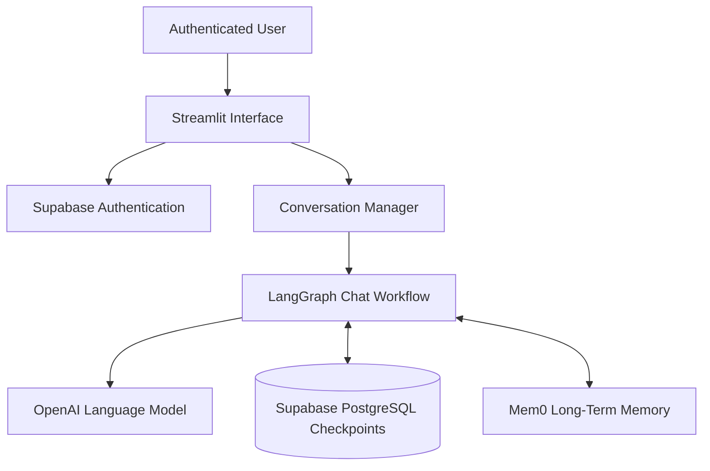

<div align="center">

# ✦ MemoryChat AI

### A multi-user conversational AI with persistent short-term and long-term memory

[](https://memorychat-ai.streamlit.app/)
[](https://github.com/rafiunshoron/memorychat-ai)


</div>

---

## Overview

MemoryChat AI is a production-style chatbot prototype designed to demonstrate how memory works at different levels in a conversational application.

Every authenticated user can create multiple conversations, return to any previous thread, and continue chatting from the saved state. LangGraph checkpoints provide persistent conversation-level memory, while Mem0 extracts and retrieves relevant user-level memories across different conversations.

> **Short-term memory remembers the conversation. Long-term memory remembers the user.**

## Core Features

- Secure email registration, confirmation, login, and logout with Supabase Auth
- Independent conversation threads for every authenticated user
- Persistent LangGraph checkpoints stored in Supabase PostgreSQL
- Token-aware message trimming before each model request
- User-scoped semantic long-term memory powered by Mem0
- Cross-conversation recall without mixing different users' memories
- Supabase Row Level Security for conversation ownership
- Responsive Streamlit interface with a polished chat experience
- Cloud deployment with protected environment secrets

## Architecture



### Request Flow

1. Supabase authenticates the user and provides a unique authentication ID.
2. The selected conversation ID is passed to LangGraph as the `thread_id`.
3. LangGraph restores that thread's messages from PostgreSQL checkpoints.
4. Mem0 searches for relevant memories using the authenticated user's ID.
5. Recent messages and relevant long-term memories are injected into the model context.
6. The assistant response is saved to the checkpoint and the completed turn is sent to Mem0 for memory extraction.

## Memory Design

| Memory layer | Scope | Identifier | Storage | Purpose |
|---|---|---|---|---|
| Short-term memory | One conversation | `thread_id` | LangGraph checkpoints in Supabase PostgreSQL | Restores complete conversation state |
| Context window | One model request | Recent messages | Runtime only | Keeps prompts within a controlled token budget |
| Long-term memory | One user across conversations | `user_id` | Mem0 Platform | Retrieves durable facts and preferences |

### Identity Mapping

| Application entity | Shared identifier |
|---|---|
| Supabase authenticated user | `auth.users.id` |
| User profile | `profiles.user_id` |
| Conversation owner | `conversations.user_id` |
| Mem0 user scope | `user_id` |
| Conversation | `conversations.id` |
| LangGraph checkpoint scope | `thread_id` |
| Mem0 conversation source | `run_id` |

Using the Supabase authentication ID as the Mem0 `user_id` keeps long-term memories isolated between users. Using the conversation ID as both LangGraph `thread_id` and Mem0 `run_id` preserves the source conversation.

## Technology Stack

| Component | Technology |
|---|---|
| Frontend | Streamlit |
| Language model | OpenAI API |
| Conversation workflow | LangGraph `MessagesState` |
| Short-term persistence | LangGraph `PostgresSaver` |
| Authentication | Supabase Auth |
| Application database | Supabase PostgreSQL |
| Long-term memory | Mem0 Platform API |
| Deployment | Streamlit Community Cloud |

## Local Setup

### 1. Requirements

- Python 3.12
- Supabase project
- Mem0 Platform API key
- OpenAI API key

### 2. Install dependencies

```bash
pip install -r requirements.txt
```

### 3. Configure environment variables

Create a local `.env` file using `.env.example` as the reference:

```env
SUPABASE_URL=your_supabase_project_url
SUPABASE_ANON_KEY=your_supabase_publishable_key
SUPABASE_DB_URL=your_supabase_session_pooler_connection_string

MEM0_API_KEY=your_mem0_api_key

OPENAI_API_KEY=your_openai_api_key
OPENAI_MODEL=gpt-5.6-luna

APP_URL=http://localhost:8501
LANGGRAPH_STRICT_MSGPACK=true
```

### 4. Prepare Supabase

Create the `profiles` and `conversations` tables, enable Row Level Security, and add policies that restrict every conversation to its authenticated owner.

Initialize the LangGraph checkpoint tables:

```bash
python setup_checkpoints.py
```

This creates the checkpoint tables used by `PostgresSaver`, including `checkpoints`, `checkpoint_blobs`, `checkpoint_writes`, and `checkpoint_migrations`.

### 5. Run the application

```bash
streamlit run app.py
```

Open `http://localhost:8501` in the browser.

## Production Configuration

The deployed application uses Streamlit Secrets rather than a committed `.env` file. The production `APP_URL` is:

```toml
APP_URL = "https://memorychat-ai.streamlit.app"
```

The same address must be configured as the Supabase Site URL and an allowed authentication redirect URL.

## Security

- Secrets are stored outside the repository.
- `.env` and `.streamlit/secrets.toml` are excluded from version control.
- Supabase Row Level Security protects user-owned conversation metadata.
- Mem0 retrieval is always filtered by the authenticated user ID.
- Retrieved memories are treated as untrusted user context, not system instructions.
- A Mem0 failure does not prevent the core chatbot from responding.

## Live Project

- **Application:** [https://memorychat-ai.streamlit.app](https://memorychat-ai.streamlit.app/)
- **Repository:** [https://github.com/rafiunshoron/memorychat-ai](https://github.com/rafiunshoron/memorychat-ai)

## License

This project is released under the [MIT License](LICENSE).

---

<div align="center">

Built to demonstrate practical multi-user conversational memory architecture with LangGraph, Supabase, Mem0, and OpenAI.

</div>
